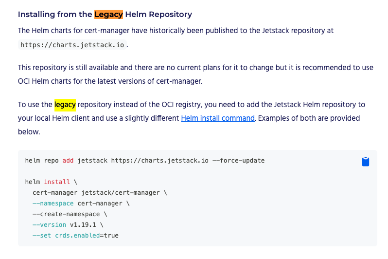

# 感觉可以淘汰legacy 了
https://cert-manager.io/docs/installation/helm/#installing-from-the-legacy-helm-repository

# 日落
全面迁移到 OCI
https://community.broadcom.com/tanzu/blogs/carlos-rodriguez-hernandez/2025/01/14/bitnami-helm-charts-moving-to-oci?CommunityKey=56a49fa1-c592-460c-aa05-019446f8102f

重定向是因为可能用户的老代码还在用这种方式。 为了保证向后兼容性。
